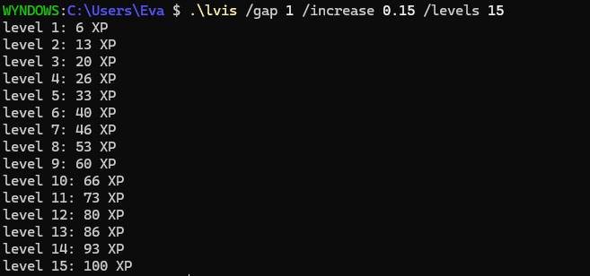

# LVis

LVis is a tiny C++ CLI app to visualise XP Required for levels.

I made this because I needed a way to test levels for my Pico8 games.

The formula I used is `floor((level / increase) ^ gap)`



# Download
Below you will find the instructions to download LVis.

## Prerequisities
To build the project, you need a few dependencies `cmake`, `ninja`, `clang` and `git`.
```bash
  # Fedora
  sudo dnf install cmake ninja clang git

  # Ubuntu
  sudo apt install cmake ninja-build clang git

  # Arch
  sudo pacman -S cmake ninja clang git
```

## Installing
First, open your favourite terminal editor.
```bash
# We must first clone the repository
git clone https://github.com/EveMeows/LVis
cd LVis
```

Now, we are free to build the project.
```bash
mkdir build && cd build

cmake .. -G Ninja -DCMAKE_BUILD_TYPE=Release
ninja
```
Done! You can now run the project with `./LVis`.

If you want, you can add the project to your path by running the following command:
```bash
sudo mv ./Lvis /usr/local/bin/lvis
```
This will also rename the program to `lvis`, making it easier to type.

## License 
GPL 3.0
