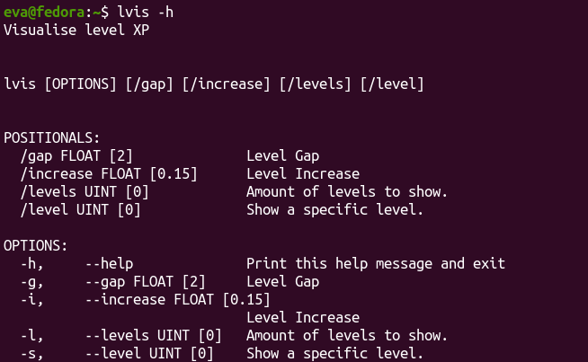

# LVis

LVis is a tiny C++ CLI app to visualise XP Required for levels.

I made this because I needed a way to test levels for my Pico8 games.

The formula I used is `floor((level / increase) ^ gap)`

# Download

You can download LVis from the [releases page](https://github.com/EveMeows/LVis).

Alternitavely, you can download [VS2022](https://visualstudio.microsoft.com/vs), and compile the project yourself, since the only dependency is vendored inside the source.

## License 
GPL 3.0